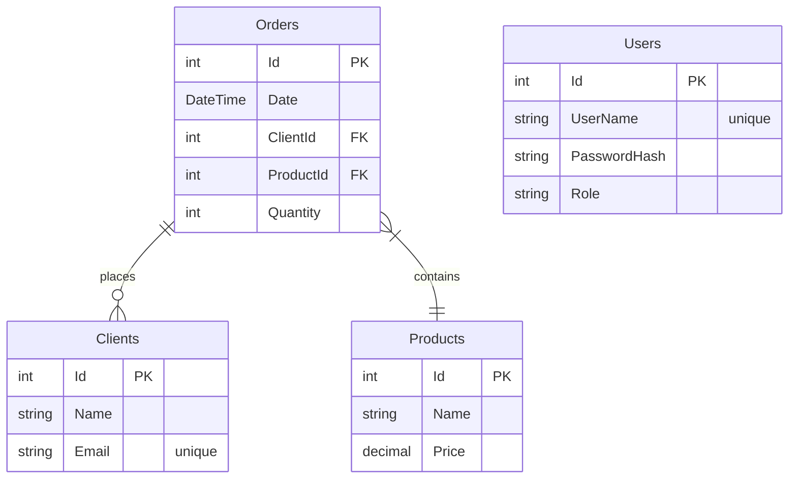
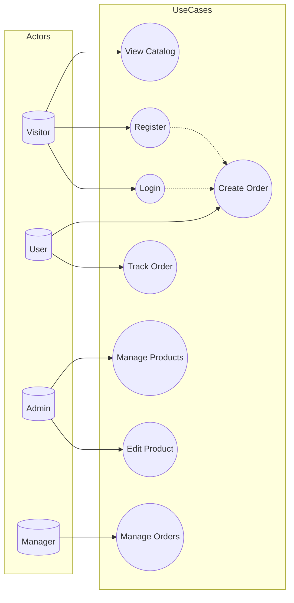

# Razor_EF

Проект Razor Pages на **C# ASP.NET Core 8** с **EF Core 8**

## 🔧 Технологический стек

| Frontend | Backend | Database | Tools |
|----------|---------|----------|-------|
| **Razor Pages** | **ASP.NET Core 8** | **SQLite** | **Bogus** (Faker) |
| **Bootstrap 5** | **EF Core 8** | **MS SQL Server** | **Serilog** |
| **Tag Helpers** | **BCrypt** | **PostgreSQL** | **Swagger** |
| **HTML Helpers** | **JWT Auth** | **Docker** | |

**Переключение БД**: `appsettings.json`

## ✨ Функционал

При первом старте (пустая БД) заполняется случайными данными через Bogus (Faker)

Razor Pages CRUD для всех таблиц с:

Tag Helpers, Html Helpers, [BindProperty]

✅ Валидация, имена полей и ошибок валидации из классов модели

✅ Обработка ошибок валидации

✅ Bootstrap дизайн

## Страницы:

🏠 Index главное меню, выбор таблиц

CRUD для 
👥 Clients
🛒 Orders
📦 Products

❌ Error (Production/Development)

## Безопасность:

🔐 Регистрация/Логин с BCrypt (BlowFish) хэшированием паролей

🍪 Cookie авторизация по ролям для страниц Razor

🔑 JWT токены для REST API по ролям

/api/orders/jwt — генерация токена

## API:

REST для Orders + Swagger UI

JWT авторизация

OrdersJwt.http для тестов

## Логирование: 
Serilog → logs/Razor_EF-xxxxxxx.txt

## Deployment

Dockerfile

docker-compose.yml

### 🗄️ ERD Диаграмма базы данных

### 🗄️ UseCase Диаграмма вариантов использования (упрощенная)

Для просмотра и редактирования диаграмм рекомендуется https://mermaid.live/